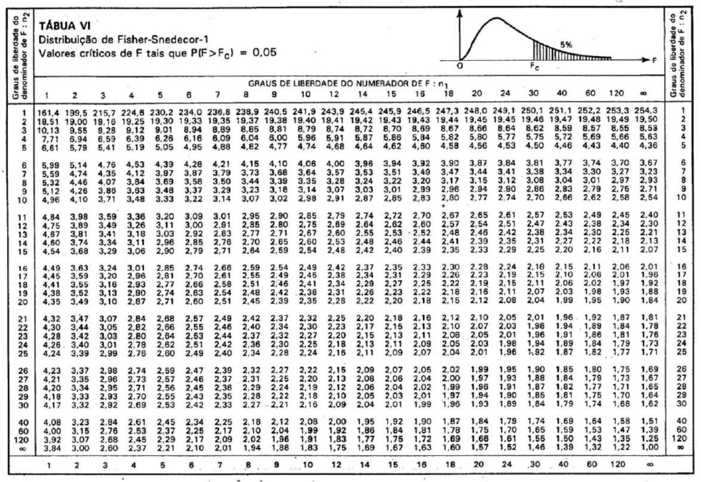

```{r setup, include=FALSE}
options(htmltools.dir.version = FALSE)
knitr::opts_chunk$set(echo=TRUE, message = FALSE, warning = FALSE, comment = "#>", fig.align = "center")
options(dplyr.print_min = 5, dplyr.print_max = 5)
```
class: middle, center, inverse

# Estimativas de Desvio-Padrão

---

## Estimativas de Desvio-Padrão

Até agora aprendemos a construir o intervalo de confiança para a média e para proporção populacional - no curso de [Estatística](https://arpanosso.github.io/estatinfo/slides/Aula10.html#17):

$$IC(\mu;1-\alpha) = ]\bar{x}-z_{\alpha/2} \frac{\sigma}{\sqrt{n}};\bar{x}+z_{\alpha/2} \frac{\sigma}{\sqrt{n}}[$$

$$IC(\mu;1-\alpha) = ]\bar{x}-z_{\alpha/2} \frac{s}{\sqrt{n}};\bar{x}+z_{\alpha/2} \frac{s}{\sqrt{n}}[$$   

$$IC(\mu;1-\alpha) = ]\bar{x}-t_{\alpha/2} \frac{s}{\sqrt{n}};\bar{x}+t_{\alpha/2} \frac{s}{\sqrt{n}}[$$

$$IC(\hat{p};1-\alpha) = \left]\hat{p}-z_{\alpha/2} \sqrt{\frac{\hat{p}\hat{q}}{n}};\hat{p}+z_{\alpha/2} \sqrt{\frac{\hat{p}\hat{q}}{n}} \right[$$

agora, serão apresentados o método para estimar o intervalo de confiança para o desvios-padrão populacional.

---
## Desvio-padrão

Relembrando do desvio padrão $s^2$, se $X_1,...X_n$ são observações **independentes** de uma população normal,

$$X_i \sim N(\mu, \sigma^2)$$
a distribuição amostral da variância amostral é um resultado fundamental da inferência estatística. Lembrando que:

$$
s^2 = \frac{1}{(n-1)} \sum \limits_{i=1}^n(x_i-\bar{x})^2
$$
Assim, o desvio padrão amostral pode ser definido como:

$$
s =\sqrt{\frac{1}{(n-1)} \sum \limits_{i=1}^n(x_i-\bar{x})^2}
$$
ou simplesmente:

$$
s = \sqrt{s^2}
$$


---
## Estimativas de Desvio-Padrão

Comecemos com intervalorde confiança para $\sigma$ baseados na estatística amostral $s$, que exigem que a população da qual extraímos as amostras tenha aproximadamente a forma de uma distribuilção normal. Nesse caso a estatística 

$$
\chi^2 = \frac{(n-1)s^2}{\sigma^2}
$$
denomaminada **estatística qui-quadrado** ($\chi$ é a letra grega minúscula *qui*). O parâmetro dessa distribuição contínua é denominado **graus de liberdade**, ou seja $(n-1)$.

Denotação:

$$
\chi^2_{n-1}
$$


Portanto, 

$$
\chi^2 = \frac{(n-1)s^2}{\sigma^2} \sim \chi^2_{n-1}
$$
---

## Distribuição Qui-quadrado

A função densidade de probabilidade da distribuição qui-quadrado para uma variável $x$ com $\nu$ graus de liberdade ( com $\nu$ > 0 ) é dada por:

$$
f(x) = \frac{1}{2^{\nu/2} \Gamma(\nu/2)}x^{(\nu/2)-1}e^{-x/2}
$$


```{r, echo=FALSE, fig.width=9, fig.height=4, fig.align='center'}
gl <- 9
x <- seq(0, 30, length.out = 1000)
y <- dchisq(x, df = gl)
plot(x, y, type = "l", lwd = 2, col = "royalblue",
     main = paste("Distribuição Qui-Quadrado (gl =", gl, ")"),
     xlab = "Valores de X", ylab = "Densidade",
     las = 1, gedit = TRUE)
abline(v = gl, col = "firebrick", lty = 2, lwd = 2)
legend("topright", legend = c("Densidade", "Média (gl = 9)"),
       col = c("royalblue", "firebrick"), lty = 1:2, lwd = 2)
```

Esperança: $E(X) = \nu$  
Variância: $Var(X) = 2\nu$

---
## Distribuição Qui-quadrado

Assim como nas distribuições $z_\alpha$ e $t_\alpha$, $\chi^2_\alpha$ é o valor para o qual a área sob a curva à sua direita é $\alpha$, cujo valor depende do número de graus de liberdade (veja Tabela a seguir).

Exemplo:  $\chi^2_{0{,}975}$ é o valor de $x$ para o qual a área sob a curva à sua esquerda é  $0{,}025$ ou seja $\alpha/2$ dado um $\alpha$ igal a $5\%$.

Essa ressalva é necessário, pois a distribuição não é simétrica, e $x$ sempre assume valores maiores ou iguais a zero $(0)$.


---
## Tabela Qui-quadrado

Mostra a área sob a curva à direita


---
**Exemplo**: Dado $9$ graus de liberdade e $\alpha$ de $5\%$, o valor de $x$ cuja área após ele é $\alpha$ será $\chi^2_{0{,}05} = 16{,}919$.


```{r grafico-qui-quadrado, echo=FALSE, fig.width=7, fig.height=4, fig.align='center'}
# 1. Definições básicas
gl <- 9
alfa <- 0.05

# 2. Encontrar o valor crítico onde começam os 5% finais
valor_critico <- qchisq(1 - alfa, df = gl)

# 3. Criar os pontos do gráfico
x <- seq(0, 30, length.out = 1000)
y <- dchisq(x, df = gl)

# 4. Gerar o gráfico base
plot(x, y, type = "l", lwd = 2, col = "royalblue",
     main = paste("Distribuição Qui-Quadrado (gl =", gl, ")"),
     xlab = "Valores de X", ylab = "Densidade", las = 1)

# 5. Criar e pintar a área sombreada (0.05 final)
x_shadow <- seq(valor_critico, 30, length.out = 100)
y_shadow <- dchisq(x_shadow, df = gl)
polygon(c(valor_critico, x_shadow, 30), c(0, y_shadow, 0), 
        col = rgb(1, 0, 0, 0.3), border = NA)

# 6. Adicionar linhas de referência (Média e Valor Crítico)
abline(v = gl, col = "firebrick", lty = 2, lwd = 1.5)
abline(v = valor_critico, col = "darkred", lty = 1, lwd = 1.5)

# 7. Adicionar legenda informativa
legend("topright", 
       legend = c("Densidade", "Média (9)", paste("Val. Crítico (", round(valor_critico, 2), ")", sep=""), "Área de Rejeição (5%)"),
       col = c("royalblue", "firebrick", "darkred", rgb(1, 0, 0, 0.3)), 
       lty = c(1, 2, 1, NA), pch = c(NA, NA, NA, 15), lwd = c(2, 1.5, 1.5, NA))
```


```{r}
qchisq(1-.05, 9)
```

---
**Exemplo**: Dado $9$ graus de liberdade e $\alpha$ de $5\%$, os valores de $x$ cujas as áreas antes e após ele são $\alpha * 2$ serão:

$\chi^2_{0{,}975} = 2{,}700$   e  $\chi^2_{0{,}025} = 19{,}023$.

```{r, grafico-qui-quadrado1, echo=FALSE, fig.width=7, fig.height=4, fig.align='center'}
# 1. Definições básicas
gl <- 9
alfa_cauda <- 0.025

# 2. Encontrar os valores críticos das duas caudas
critico_inf <- qchisq(alfa_cauda, df = gl)      # Cauda esquerda (2.5%)
critico_sup <- qchisq(1 - alfa_cauda, df = gl)  # Cauda direita (2.5%)

# 3. Criar os pontos do gráfico
x <- seq(0, 30, length.out = 1000)
y <- dchisq(x, df = gl)

# 4. Gerar o gráfico base
plot(x, y, type = "l", lwd = 2, col = "royalblue",
     main = paste("Distribuição Qui-Quadrado Bicaudal (gl =", gl, ")"),
     xlab = "Valores de X", ylab = "Densidade", las = 1)

# 5. Sombrear a cauda esquerda (0 a critico_inf)
x_esq <- seq(0, critico_inf, length.out = 100)
y_esq <- dchisq(x_esq, df = gl)
polygon(c(0, x_esq, critico_inf), c(0, y_esq, 0), 
        col = rgb(1, 0, 0, 0.3), border = NA)

# 6. Sombrear a cauda direita (critico_sup a 30)
x_dir <- seq(critico_sup, 30, length.out = 100)
y_dir <- dchisq(x_dir, df = gl)
polygon(c(critico_sup, x_dir, 30), c(0, y_dir, 0), 
        col = rgb(1, 0, 0, 0.3), border = NA)

# 7. Adicionar linhas dos valores críticos e da média
abline(v = gl, col = "firebrick", lty = 2, lwd = 1.5)
abline(v = c(critico_inf, critico_sup), col = "darkred", lty = 1, lwd = 1.5)

# 8. Legenda descritiva
legend("topright", 
       legend = c("Densidade", 
                  "Média (9)", 
                  paste("Cortes (", round(critico_inf, 2), " e ", round(critico_sup, 2), ")", sep=""), 
                  "Áreas de Rejeição (2.5% cada)"),
       col = c("royalblue", "firebrick", "darkred", rgb(1, 0, 0, 0.3)), 
       lty = c(1, 2, 1, NA), pch = c(NA, NA, NA, 15), lwd = c(2, 1.5, 1.5, NA),
       bty = "n") # Remove a borda da legenda para economizar espaço no slide
```

```{r}
qchisq(1-.025, 9)
qchisq(.025, 9)
```


---
## Estimativa do desvio-padrão

Semelhante ao realizado para construção dos intervalos e confiança para a média, temos que $1-\alpha$ é a probabilidade da variável aleatória com uma distribuição $\chi^2$ assuma um valor entre:

$$\chi^2_{1-\alpha /2} < \chi^2 < \chi^2_{\alpha /2}$$

A desigualdade pode ser reescrita como:

$$\frac{(n-1)s^2}{\chi^2_{\alpha /2}}<\sigma^2<\frac{(n-1)s^2}{\chi^2_{1-\alpha /2}}$$

Assim,

$$IC(\sigma^2;1-\alpha) = \left]  \frac{(n-1)s^2}{\chi^2_{\alpha /2}} ;\frac{(n-1)s^2}{\chi^2_{1-\alpha /2}} \right[$$

---

**Exemplo**: Durante a execução de determinada tarefa sob condições simuladas de imponderabilidade, a média da taxa de batimentos cardíacos de $12$ astronautas aumentou em $27{,}33$ batimentos por minuto, com desvio-padrãode $4{,28}$ batimentos por minuto. 


```{r,out.width = "60%",fig.cap="",fig.align = 'center',echo=FALSE}
knitr::include_graphics("https://media3.giphy.com/media/v1.Y2lkPTc5MGI3NjExZXluZnp3cTh1Z25hZXgwaHhkZTZzeGQ4eWsydTI2N3pjYzFiNXUyYiZlcD12MV9pbnRlcm5hbF9naWZfYnlfaWQmY3Q9Zw/3o7btZ3T6y3JTmjg4w/giphy.gif")
```

a) Construa um intervalo de $99\%$ de confiança para o verdadeiro aumento médio $(\mu)$ da taxa de batimentos cardíacos dos astronautas no desempenho da tarefa.

b) Construa um intervalo de $99\%$ de confiança para $\sigma$, o real desvio médio do acréscimo da taxa de batimentos cardíacos dos astronautas nessas condições.

---
**Solução**

a) Dado que o tamanho da amostra é inferior a $30$ e o desvio padrão $\sigma$ é desconhecidos, utilizaremos a distribuição t de Student. Assim:

$$IC(\mu;1-\alpha) = ]\bar{x}-t_{\alpha/2} \frac{s}{\sqrt{n}};\bar{x}+t_{\alpha/2} \frac{s}{\sqrt{n}}[$$
Dados:  
$n = 12$
$\bar{x}=27{,}33$  
$s = 4{,}28$  
$\alpha = 0{,}01$  
$t_{0{,}01} = 3{,}106$ (encontrado na [Tabela](https://github.com/arpanosso/estatistica-aplicada-adm/blob/master/docs/Tabela_tdeStudent.pdf) para $11$ graus de liberdade). 

$$IC(\mu;99\%) = ]27{,}33-3{,}106 \frac{4{,}28}{\sqrt{12}};27{,}33+3{,}106 \frac{4{,}28}{\sqrt{12}}[$$
$$IC(\mu;99\%) = ]23{,}59;31{,}17[$$
---

**Solução**

b) Construa um intervalo de $99\%$ de confiança para $\sigma$, o real desvio médio do acréscimo da taxa de batimentos cardíacos dos astronautas nessas condições.

Dados:  
$n = 12$
$\nu = 11$ graus de liberdade
$s = 4{,}28$  
$\alpha = 0{,}01$  
$\chi^2_{0{,}995} = 2{,}606$   
$\chi^2_{0{,}005} = 26{,}757$ 

Ambos encontrados na [Tabela](https://github.com/arpanosso/estatistica-aplicada-adm/blob/master/docs/TabelaQuiQuadrado.pdf) para $11$ graus de liberdade. 

$$IC(\sigma^2;99\%) = \left]  \frac{(12-1)4{,}28}{26{,}757} ;\frac{(12-1)4{,}28}{2{,}606} \right[$$
Assim, temos:

$$IC(\sigma^2;99\%) = \left]  7{,}53 ; 77{,}41 \right[$$

Finalmente, extraindo as raízes quadradas temos:

$$IC(\sigma;99\%) = \left]  2{,}74 ; 8{,}80 \right[$$
---
class: middle, center, inverse

#Tabelas de Contingência
##Associação e Independência

---

### Análise de uma Tabela de Contingência $( r \times c)$

O método que vamos descrever é uma aplicação da estatística $\chi^2$ em vários tipos e problemas que diferem conceitualmente, mas que são analisados da mesma maneira. 

Tabelas r x c, referem-se ao número de linhas (r, do inglês rows) e colunas (c - do inglês columns)

--
.center[

]


---
### Análise de uma Tabela de Contingência $( r \times c)$

Incialmente, consideramos um problema de generalização imediata, que estudamos na [Aula 6](https://arpanosso.github.io/estatinfo/slides/Aula06.html#39) do Curso de Estatística do semestre passado:

Dada a seguinte tabela, referente ao sexo $(F, M)$ e a cor do cabelo (*Ruivos* e *Não Ruivos*) de crianças em uma escola:

 | Ruivo $(R)$ | Não Ruivo $(\bar{R})$ | TOTAL
---|:---:|:---:|:---:|---:
**Feminino $(F)$** | 4  | 26 | **30**
**Masculino $(\bar{F})$** | 17 | 13 | **30** 
**TOTAL** | **21** | **39** | **60**

Ao selecionarmos um aluno ao acaso, pergunta-se:

a) Qual a probabilidade do estudante ser *Ruivo*?  
b) Qual a probabilidade do estudante ser do sexo *Feminino*?  
c) Qual a probabilidade do estudante ser do sexo *Feminino* **e** *Ruivo*?  
d) Qual a probabilidade do estudante ser do sexo *Feminino* **ou** *Ruivo*?  
e) A cor do cabelo depende do sexo?

---

**Solução:**

 | Ruivo $(R)$ | Não Ruivo $(\bar{R})$ | TOTAL
---|:---:|:---:|:---:|---:
**Feminino $(F)$** | 4  | 26 | **30**
**Masculino $(\bar{F})$** | 17 | 13 | **30** 
**TOTAL** | **21** | **39** | **60**
a) $P(Ruivo ) = \frac{21}{60} = 0,35$


b) $P(Feminino) = \frac{30}{60} = 0,50$


c)  $P(Feminino \cap Ruivo) = \frac{4}{60} = 0,06667$

d) 
$P(F \cup R) = P(F)  + P(R) - P(F \cap R) \\ P(F \cup R) = \frac{21}{60} + \frac{30}{60} -\frac{4}{60} \\ P(F \cup R)= \frac{47}{60} = 0,7833$

---

Observe que os totais das colunas $(4+17)= 21$ e $(26+13) = 39$ dependem da cor do cabelo das pessoas, ou seja da decisão em mudar ou não a cor do cabelo, ou seja, do acaso. 

Essa tabela é dita "uma tabela 2 por 2" $(2 \times 2)$.


 | Ruivo $(R)$ | Não Ruivo $(\bar{R})$ | TOTAL
---|:---:|:---:|:---:|---:
**Feminino $(F)$** | 4  | 26 | **30**
**Masculino $(\bar{F})$** | 17 | 13 | **30** 
**TOTAL** | **21** | **39** | **60**

A hipótese nula que queremos testar é que para a cordo cabelo $(R \text{ e } \bar{R})$ as probabilidades são as mesmas para cada um dos sexos avaliados $(F \text{ e } \bar{F})$, ou seja a $P(R|F) = P(R|\bar{F})$ e $P(\bar{R}|F) = P(\bar{R}|\bar{F})$.

Em outras palavras, estamos testando se existe uma relação entre a cor do cabelo e o sexo. Assim, as hipoteses testadas em tabelas de contingência são

$$
\begin{cases}
H_0: \text{as duas variáveis são independentes} \\
H_1: \text{as duas variáveis não são independentes}
\end{cases}
$$
---

Para construção do nosso teste, seguiremos a seguinte lógica: Se a hipótese nula é verdadeira, podemos combinar as duas amostras e estima a probabilidade de que uma pessoa vá escolher "pintar o cabelo de ruivo" $R$,  $\frac{(4+17)}{60} = \frac{21}{60}$.

Então, dentre as 30 pessoas do sexo feminino  e 30 pessoas do sexo masculino podemos esperar:

Para $F$: $\frac{21\times 30}{60}  = 10{,}5$   
Para $\bar{F}$: $\frac{21\times 30}{60} = 10{,}5$ 

sejam ruivos. Assim,

  > Obtém-se a frequência esperada de qualquer céluda de uma tabela r x c multiplicando o total da linha à qual pertence pelo total da coluna à qual pertence e, em seguida, dividir o resultado pelo total geral da tabela.
  
Agora, para os não ruivos $\bar{R}$ os resultados das frequêcias esperadas podem ser calculados por subtração dos totais das linhas, portanto, podemos esperar:

Para $F$: $30 -  10{,}5 = 19{,}5$   
Para $\bar{F}$: $30 -  10{,}5 = 19{,}5$ 

não ruivos.

---

Os resultados podem ser resumidos na tabela a seguir, em que as frenquências esperadas aparecem entre parênteses, abaixo das frequências observadas correspondentes:

 | Ruivo $(R)$ | Não Ruivo $(\bar{R})$ | TOTAL
---|:---:|:---:|:---:|---:
**Feminino $(F)$** | 4 <br> (10,5) | 26 <br> (19,5) | **30**
**Masculino $(\bar{F})$** | 17 <br> (10,5)| 13 <br> (19,5)| **30** 
**TOTAL** | **21** | **39** | **60**

Para testar a hipótese nula sob as frequências esperada das células, podemos compará-las com as frequências observadas. denotando $O$ para as frequências observadas e $E$ para as esperadas, a base de comparação é a estatítica qui-quadrado:

$$\chi^2_{obs} = \sum \frac{(O-E)^2}{E}$$
Se $H_0$ é verdadeira, essa estatística é um valor de uma variável aleatória que tem aproximadamente a distribuição $\chi^2$ com $(r-1)(c-1)$ graus de liberdade, no nosso exemplo $(2-1)(2-1) = 1$

---
Calculando a estatítica do Teste


$$\chi^2_{obs} = \frac{(4-10{,}5)^2}{10{,}5} + \frac{(26-19{,}5)^2}{19{,}5} + \frac{(17-10{,}5)^2}{10{,}5} + \frac{(13-19{,}5)^2}{19{,}5}= 12{,38}$$

Considerando um $\alpha = 5%$ e gl = $1$, pela tabela temos 

```{r grafico-qui-quadrado-ex, echo=FALSE, fig.width=7, fig.height=4, fig.align='center'}
# 1. Definições básicas
gl <- 1
alfa <- 0.05
estatistica <- 12.38
# 2. Encontrar o valor crítico onde começam os 5% finais
valor_critico <- qchisq(1 - alfa, df = gl)

# 3. Criar os pontos do gráfico
x <- seq(0, 30, length.out = 1000)
y <- dchisq(x, df = gl)

# 4. Gerar o gráfico base
plot(x, y, type = "l", lwd = 2, col = "royalblue",
     main = paste("Distribuição Qui-Quadrado (gl =", gl, ")"),
     xlab = "Valores de X", ylab = "Densidade", las = 1)

# 5. Criar e pintar a área sombreada (0.05 final)
x_shadow <- seq(valor_critico, 30, length.out = 100)
y_shadow <- dchisq(x_shadow, df = gl)
polygon(c(valor_critico, x_shadow, 30), c(0, y_shadow, 0), 
        col = rgb(1, 0, 0, 0.3), border = NA)

# 6. Adicionar linhas de referência (Média e Valor Crítico)
abline(v = estatistica, col = "firebrick", lty = 2, lwd = 1.5)
abline(v = valor_critico, col = "darkred", lty = 1, lwd = 1.5)

# 7. Adicionar legenda informativa
legend("topright", 
       legend = c("Densidade", "Estatística do Teste", paste("Val. Crítico (", round(valor_critico, 2), ")", sep=""), "Área de Rejeição (5%)"),
       col = c("royalblue", "firebrick", "darkred", rgb(1, 0, 0, 0.3)), 
       lty = c(1, 2, 1, NA), pch = c(NA, NA, NA, 15), lwd = c(2, 1.5, 1.5, NA))
```
Região Crítica:

$RC = \{ \chi^2 | \chi^2 \ge 3{,84}\}$
$\chi^2_{obs} \in RC$

**Conclusão** Rejeitamos $H_0$ ao nível de $5\%$ de significância e concluímos que as variávies não são independentes.

---

```{r}
dados <- matrix(
  c(4, 26,
    17, 13),
  nrow = 2,
  byrow = TRUE
)
dados
chisq.test(dados, correct = FALSE)
```

---
class: middle, center, inverse

# Comparações de parâmetros de duas populações

---


Suponha duas amostras aleatórias independentes de tamanhos $n_1$ e $n_2$ ou seja, $X_1 , X_2 , ..., X_{n1}$ e $Y_1 ,Y_2 , ...,Y_{n2}$, respectivamente, de uma população com distribuição $N(\mu_1, \sigma_1^2)$ e de população com distribuição $N(\mu_2, \sigma_2^2)$

### Hipóteses

$H_0: \sigma_1^2 = \sigma_2^2$ ou seja $\left(\frac{\sigma_1^2}{\sigma_2^2} = 1 \right)$ 

$H_1: \sigma_1^2 \neq \sigma_2^2$ ou seja $\left(\frac{\sigma_1^2}{\sigma_2^2} \neq 1 \right)$ 

---

### Estatística do teste:

Sendo $s_1^2$ e $s_2^2$ as variâncias, respectivamente das amostras $n_1$ e $n_2$, o quociente

$$\frac{s^2_1 / \sigma_1^2}{ s^2_2 / \sigma^2_2}$$

Segue a distribuição de $F$ (Snedecor) com $n_1-1$ e $n_2-1$ graus de liberdade $(GL)$, tem a denotação $F(n_1-1, n_2-1)$.

Sob a suposição de $H_0$ ser verdadeira, isto é, $\sigma^2_1 = \sigma^2_2$, tem-se que

$F = \frac{s^2_1}{s^2_2} \sim F(n_1-1, n_2-1)$

---

#### Construção da região crítica

Fixado $\alpha$, os pontos críticos serão $F_1$ e $F_2$ da distribuição $F$, tais que:

```{r,out.width = "80%",fig.cap="",fig.align = 'center',echo=FALSE}
knitr::include_graphics("https://raw.githubusercontent.com/arpanosso/estatinfo/master/slides/img/testeH_17.png")
```

Se $\alpha = 10\%$, pode-se, utilizando a Tabela da distribuição $F$, encontrar diretamente $F_2(5\%)$. Para encontrar $F_1(95\%)$ utiliza-se a propriedade:


$F_{(1-\alpha;\;n_1-1,\; n_2-1)} = \frac{1}{F_{(\alpha;\;n_2-1,\; n_1-1)}}$, assim: $F_{(0,95;\;n_1-1,\; n_2-1)} = \frac{1}{F_{(0,05;\;n_2-1,\; n_1-1)}}$

---

#### Exemplo: Construir a regição crítica para o caso abaixo:

Se $n_1 - 1= 5$ e $n_2-1 = 7$ dado $\alpha = 10\%$


$F2_{(0,05;\;5,\; 7)} = 3,97$ olhamos na tabela

---
[Tabela - Distribuição F-Snedecor](https://github.com/arpanosso/estatinfo/raw/master/docs/TabelaFSnedecor.pdf) 



---

F1 precisamos calcular:

$F1_{(0,95;\;5,\; 7)} = \frac{1}{F_{(0,05;\;7,\; 5)}}=\frac{1}{4,88} = 0,205$


Assim, $RC = \{0 < F < 0,205 \text{ ou }  F > 3,97 \}$

---

Entretanto, o procedimento que se usa na prática é calcular $F$ utilizando sempre a maior variância no numerador $s_1^2 > s^2_2$ portanto $F > 1$, e considerar o ponto crítico $F_{2(\alpha;\;n1-1,\; n2-1)}$.

**Amostra:** Colhidas amostras aleatórias $n_1$ e  $n_2$, calcula-se $s^2_1$ e $s^2_2$ com $(s^2_1 > s^2_2)$, então:

$$F_{obs} = \frac{s^2_1}{s^2_2} \sim F_{(n_1-1;n_2-1)}$$

**Conclusão:** Se $F_{obs} \in RC$, **rejeita-se** $H_0$, no caso contrário, **não se rejeita** $H_0$.

---

**Exemplo**. Dois grupo de $8$ animais da mesma idade e raças diferentes foram submetidos a um mesmo regime alimentar. Os resultados para ganho de peso foram:

| | | | | | | | 
---| ---|--- | ---| ---|--- |--- |--- | 
**R1:** | $2,30$   | $2,10$   | $1,91$   | $1,20$   | $1,93$   | $1,88$   | $1,95$   | $2,10$
**R2:** | $2,30$   | $2,15$   | $2,00$   | $1,28$   | $2,15$   | $2,20$   | $1,91$   | $2,06$

Ao nível de $5\%$, as variâncias dos ganhos de pesos raças diferem entre si?

---

```{r}
r1<-c(2.30,2.10,1.91,1.20,1.93,1.88,1.95,2.10)
r2<-c(2.30,2.15,2.00,1.28,2.15,2.20,1.91,2.06)
var.test(r1,r2)
```

---

Testar as hipóteses:

$$
\begin{cases}
H_0: \sigma_{r1}^2 = \sigma_{r2}^2 \\
H_1: \sigma_{r1}^2 \neq \sigma_{r2}^2
\end{cases}
$$
Calculando os valores de variância para as duas raças:

$s_{r1}^2 = 0,10433$ 

e  

$s_{r2}^2 = 0,10068$

sendo que $n_{r1} = n_{r2} = 8$ 

e $\alpha = 5\%$


A estatística do teste: $\frac{s_{r1}^2}{s_{r2}^2} = \frac{0,10433}{0,10068} = 1,03618$

---
$F_{c(0,05; 7, 7)} = 3,79$ assim, $RC = \{  F > 3,79 \}$
```{r,echo=FALSE}
curve(df(x,7,7),0,7,xlab="t",ylab="d",
      main="F(7,7)")
abline(v=1.03618,col="red",lty=2)
segments(3.79,-1,3.79,df(3.79,7,7))
text(1.5,0,"Fobs",col="red")
text(5,0,"RC",col="black")
```


Como $F_{obs} \notin RC$ não se rejeita $H_0$, ou seja, as variâncias são estatisticamente iguais ao nível de 5% de significância, ou seja, as variâncias dos ganhos de peso das raças são homocedásticas.

---

### Comparação de duas médias de populações normais: amostras independentes

A análise da hipótese da igualdade de variâncias é crucial para o uso do teste *t*, na comparação de duas médias, apresentado a seguir.

Com o objetivo de se comparar duas populações examinaremos a situação na qual os dados estão na forma de realizações de amostras aleatórias de tamanhos $n_1$ e $n_2$, selecionadas, respectivamente, das populações $1$ e $2$. 

Uma coleção de $n_1 + n_2$ elementos são aleatoriamente divididos em $2$ grupos de tamanhos $n_1$ e $n_2$, onde cada membro do primeiro grupo recebe o tratamento $1$ e do segundo, o tratamento $2$. Especificamente, estaremos interessados em fazer inferência sobre o parâmetro:

$\mu_1 - \mu_2$ = (média da população 1) – (média da população 2)

**Hipótese:** $H_0: \mu_1 = \mu_2$ ou seja, $\mu_1 - \mu_2 = 0$

**Estatística do teste:** $Z = \frac{(\bar{X}-\bar{Y})-(\mu_1-\mu_2)}{\sqrt{\frac{\sigma^2_1}{n_1} + \frac{\sigma^2_2}{n_2}}} \sim N(0,1)$

---

#### Caso 1: variâncias conhecidas

$Z = \frac{(\bar{X}-\bar{Y})}{\sqrt{\frac{\sigma^2_1}{n_1} + \frac{\sigma^2_2}{n_2}}} \sim N(0,1)$

#### Caso 2: variâncias desconhecidas e iguais

Preliminarmente, testa-se se as variâncias das duas populações são iguais. Caso a hipótese não seja rejeitada, isto é, que $\sigma_1^2=\sigma_2^2=\sigma^2$, a estatística anterior transforma-se em:

$Z = \frac{(\bar{X}-\bar{Y})}{\sigma\sqrt{\frac{1}{n_1} + \frac{1}{n_2}}}$ , substituimos $\sigma$ por um estimador, teremos uma expressão muito semelhante à $t$ de Student. Uma estatística para $\sigma^2$ é a média ponderada:

$S_P^2 = \frac{(n_1-1)s_1^2+(n_2-1)s^2_2}{(n_1-1)+(n_2-1)}$

que, como $s^2_1$ e $s^2_2$ são dois estimadores não viciados de $\sigma^2$, também é um estimador não viciado de $\sigma^2$.

Assim, $t = \frac{(\bar{X} - \bar{Y})}{s_p\sqrt{\frac{1}{n_1}+\frac{1}{n_2}}} \sim t(n_1+n_2 - 2) GL$
---


**Exemplo**. Dois grupo de $8$ animais da mesma idade e raças diferentes foram submetidos a um mesmo regime alimentar. Os resultados para ganho de peso foram:

| | | | | | | | 
---| ---|--- | ---| ---|--- |--- |--- | 
**R1:** | $2,30$   | $2,10$   | $1,91$   | $1,20$   | $1,93$   | $1,88$   | $1,95$   | $2,10$
**R2:** | $2,30$   | $2,15$   | $2,00$   | $1,28$   | $2,15$   | $2,20$   | $1,91$   | $2,06$

Ao nível de $5\%$, as médias dos ganhos de pesos raças diferem entre si?

---

```{r}
r1<-c(2.30,2.10,1.91,1.20,1.93,1.88,1.95,2.10)
r2<-c(2.30,2.15,2.00,1.28,2.15,2.20,1.91,2.06)
t.test(r1, r2, alternative = "le", var.equal = TRUE)
```

---

Usando os dados do exemplo anterior, testar se há evidência de que as duas raças
apresentam o mesmo ganho de peso $(H_0: \mu_A = \mu_B \text{ vs. } H_1: \mu_A < \mu_B)$, ao nível de $5\%$.


$$
\begin{cases}
H_0: \mu_{r1} = \mu_{r2} \\
H_1: \mu_{r1} < \mu_{r2}
\end{cases}
$$

Calculando os valores de média e desvio-padrão:


$\bar{X} = 1,92125$ e $s_{r1}^2 = 0,10433$ e  $\bar{Y} = 2,00625$ e $s_{r2}^2 = 0,10068$

sendo que $n_{r1} = n_{r2} = 8$ e $\alpha = 5\%$

Assim, 

$S_P^2 = \frac{(n_1-1)s_1^2+(n_2-1)s^2_2}{(n_1-1)+(n_2-1)} = \frac{(8-1)0,10433+(8-1)0,10068}{(8-1)+(8-1)} = 0,1025054$

sendo $S_P = 0,3201646$

Portanto, 

$t_{obs} = \frac{(\bar{X} - \bar{Y})}{s_p\sqrt{\frac{1}{n_1}+\frac{1}{n_2}}} = \frac{(1,92125 - 2,00625)}{0,3201646\sqrt{\frac{1}{8}+\frac{1}{8}}} = -0,5309908$

---

```{r,out.width = "100%",fig.cap="",fig.align = 'center',echo=FALSE}
knitr::include_graphics("https://raw.githubusercontent.com/arpanosso/estatinfo/master/slides/img/ic_05.png")
```

Para a construção da **região crítica** do teste: $t_c(14; 0,05) = -1,761$ assim, a região crítica é $RC = \{ t \le -1,76131\}$


---
**Conclusão**: Como $t_{obs} \notin RC$, não rejeita-se $H_0$, não há evidências de que a raça 1 apresenta maior ganho de peso que a raça 2.

```{r,echo=FALSE}
curve(dt(x,14),-4,4,xlab="t",ylab="d",
      main="t(14)")
abline(v=0,col="black",lty=2)
abline(v=-0.5309,col="red",lty=2)
segments(-1.76,-1,-1.76,dt(-1.76,14))
text(-0.6,0,"tobs",col="red")
text(-2.6,0,"RC",col="black")
```


---

#### Caso 3: variâncias desconhecidas e desiguais (Teste de Smith – Satterthwaite)


Quando a hipótese de igualdade de variâncias for rejeitada, deve-se substituir $\sigma^2_1$ e $\sigma^2_2$ pelos seus respectivos estimadores $s^2_1$ e $s^2_2$ obtendo a estatística:


$$t = \frac{(\bar{X}-\bar{Y})}{\sqrt{\frac{s^2_1}{n_1}+\frac{s^2_2}{n_2}}}$$

que sob a veracidade de $H_0$ $(\mu_1 - \mu_2 = 0)$, aproxima-se de uma distribuição $t$ de Student, com número de graus de liberdade dado aproximadamente por:

$$gl=\frac{\frac{s^2_1}{n_1} + \frac{s^2_2}{n_2}}{\frac{\left( \frac{s^2_1}{n_1} \right)^2}{n_1-1}+\frac{\left( \frac{s^2_2}{n_2}  \right)^2}{n_2-1}}$$
---

Como o número de graus de liberdade assim calculado, geralmente, é **não inteiro**, recomenda-se aproximá-lo para o inteiro imediatamente anterior a este.

Se $n_1$ e $n_2$ são ambos grandes $(n \ge 30)$, o teste pode ser baseado na estatística.

$$Z = \frac{(\bar{X}-\bar{Y})-(\mu_1-\mu_2)}{\sqrt{\frac{s^2_1}{n_1}+\frac{s^2_2}{n_2}}} \sim N(0,1) \text{ sob } H_0$$

pois permanece válido se $\sigma^2_1$ e $\sigma^2_2$ são substituídos por seus respectivos estimadores amostrais $s^2_1$ e $s^2_2$.


**Nota**: no caso da inferência originada de amostras grandes, não é necessário assumir que as distribuições das populações originais são normais, porque o teorema  central do limite garante que as médias amostrais X e Y são aproximadamente distribuídas como $N( \mu_1, \sigma^2 / n_1 )$ e $N( \mu_2, \sigma^2 / n_2 )$, respectivamente. Além disso, a suposição de variâncias populacionais iguais $(\sigma^2_1 = \sigma^2_2)$ que é usada para amostras pequenas, é evitada nessa situação.


