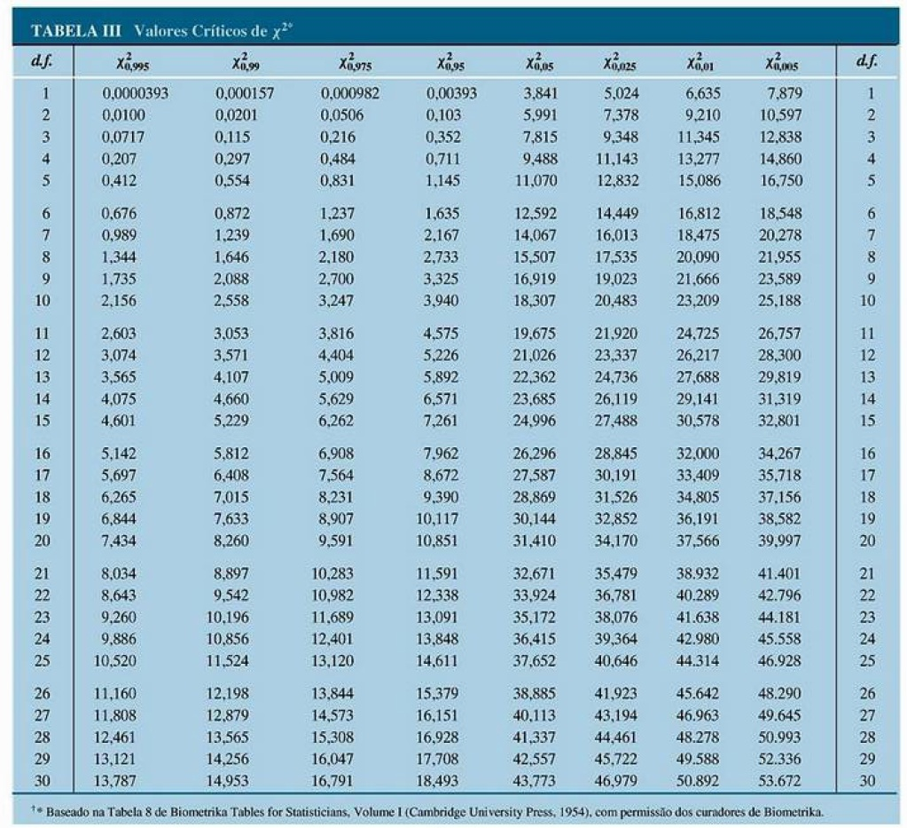
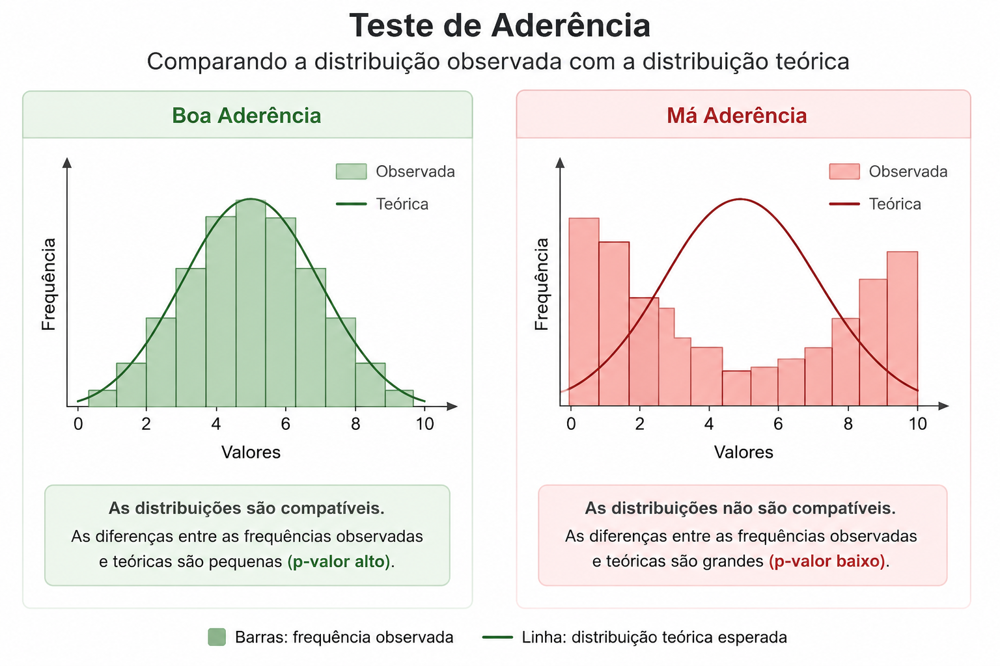
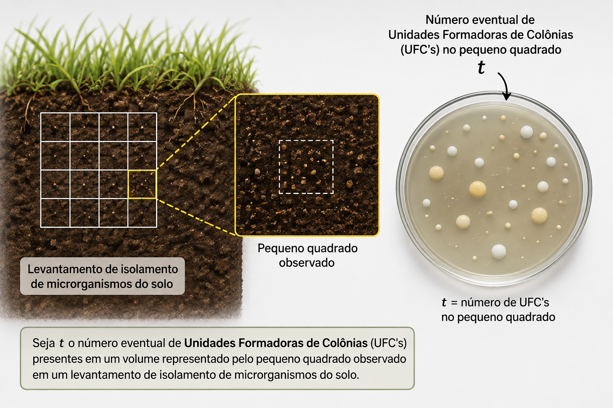

```{r setup, include=FALSE}
options(htmltools.dir.version = FALSE)
knitr::opts_chunk$set(echo=TRUE, message = FALSE, warning = FALSE, comment = "#>", fig.align = "center")
options(dplyr.print_min = 5, dplyr.print_max = 5)
```
class: middle, center, inverse

# Estimativas de Desvio-Padrão

---

## Estimativas de Desvio-Padrão

Até agora aprendemos a construir o intervalo de confiança para a média e para proporção populacional - no curso de [Estatística](https://arpanosso.github.io/estatinfo/slides/Aula10.html#17) do primeiro semestre:

$$IC(\mu;1-\alpha) = ]\bar{x}-z_{\alpha/2} \frac{\sigma}{\sqrt{n}};\bar{x}+z_{\alpha/2} \frac{\sigma}{\sqrt{n}}[$$

$$IC(\mu;1-\alpha) = ]\bar{x}-z_{\alpha/2} \frac{s}{\sqrt{n}};\bar{x}+z_{\alpha/2} \frac{s}{\sqrt{n}}[$$   

$$IC(\mu;1-\alpha) = ]\bar{x}-t_{\alpha/2} \frac{s}{\sqrt{n}};\bar{x}+t_{\alpha/2} \frac{s}{\sqrt{n}}[$$

$$IC(\hat{p};1-\alpha) = \left]\hat{p}-z_{\alpha/2} \sqrt{\frac{\hat{p}\hat{q}}{n}};\hat{p}+z_{\alpha/2} \sqrt{\frac{\hat{p}\hat{q}}{n}} \right[$$

agora, serão apresentados o método para estimar o intervalo de confiança para o desvios-padrão populacional.

---
## Desvio-padrão

Relembrando do desvio padrão $s^2$, se $X_1,...X_n$ são observações **independentes** de uma população normal,

$$X_i \sim N(\mu, \sigma^2)$$
a distribuição amostral da variância amostral é um resultado fundamental da inferência estatística. Lembrando que:

$$
s^2 = \frac{1}{(n-1)} \sum \limits_{i=1}^n(x_i-\bar{x})^2
$$
Assim, o desvio padrão amostral pode ser definido como:

$$
s =\sqrt{\frac{1}{(n-1)} \sum \limits_{i=1}^n(x_i-\bar{x})^2}
$$
ou simplesmente:

$$
s = \sqrt{s^2}
$$


---
## Estimativas de Desvio-Padrão

Comecemos com intervalorde confiança para $\sigma$ baseados na estatística amostral $s$, que exigem que a população da qual extraímos as amostras tenha aproximadamente a forma de uma distribuilção normal. Nesse caso a estatística 

$$
\chi^2 = \frac{(n-1)s^2}{\sigma^2}
$$
denomaminada **estatística qui-quadrado** ($\chi$ é a letra grega minúscula *qui*). O parâmetro dessa distribuição contínua é denominado **graus de liberdade**, ou seja $(n-1)$.

Denotação:

$$
\chi^2_{(n-1)}
$$


Portanto, 

$$
\chi^2 = \frac{(n-1)s^2}{\sigma^2} \sim \chi^2_{n-1}
$$
---

## Distribuição Qui-quadrado

A função densidade de probabilidade da distribuição qui-quadrado para uma variável $x$ com $\nu$ graus de liberdade ( com $\nu$ > 0 ) é dada por:

$$
f(x) = \frac{1}{2^{\nu/2} \Gamma(\nu/2)}x^{(\nu/2)-1}e^{-x/2}
$$


```{r, echo=FALSE, fig.width=9, fig.height=4, fig.align='center'}
library(tidyverse)
gl <- 9
x <- seq(0, 30, length.out = 1000)
y <- dchisq(x, df = gl)
plot(x, y, type = "l", lwd = 2, col = "royalblue",
     main = paste("Distribuição Qui-Quadrado (gl =", gl, ")"),
     xlab = "Valores de X", ylab = "Densidade",
     las = 1, gedit = TRUE)
abline(v = gl, col = "firebrick", lty = 2, lwd = 2)
legend("topright", legend = c("Densidade", "Média (gl = 9)"),
       col = c("royalblue", "firebrick"), lty = 1:2, lwd = 2)
```

Esperança: $E(X) = \nu$  
Variância: $Var(X) = 2\nu$

---
## Distribuição Qui-quadrado

Assim como nas distribuições $z_\alpha$ e $t_\alpha$, $\chi^2_\alpha$ é o valor para o qual a área sob a curva à sua direita é $\alpha$, cujo valor depende do número de graus de liberdade (veja Tabela a seguir).

Exemplo:  $\chi^2_{0{,}975}$ é o valor de $x$ para o qual a área sob a curva à sua esquerda é  $0{,}025$ ou seja $\alpha/2$ dado um $\alpha$ igal a $5\%$.

Essa ressalva é necessário, pois a distribuição não é simétrica, e $x$ sempre assume valores maiores ou iguais a zero $(0)$.


---
## Tabela Qui-quadrado

Mostra a área sob a curva à direita


---
**Exemplo**: Dado $9$ graus de liberdade e $\alpha$ de $5\%$, o valor de $x$ cuja área após ele é $\alpha$ será $\chi^2_{0{,}05} = 16{,}919$.


```{r grafico-qui-quadrado, echo=FALSE, fig.width=7, fig.height=4, fig.align='center'}
# 1. Definições básicas
gl <- 9
alfa <- 0.05

# 2. Encontrar o valor crítico onde começam os 5% finais
valor_critico <- qchisq(1 - alfa, df = gl)

# 3. Criar os pontos do gráfico
x <- seq(0, 30, length.out = 1000)
y <- dchisq(x, df = gl)

# 4. Gerar o gráfico base
plot(x, y, type = "l", lwd = 2, col = "royalblue",
     main = paste("Distribuição Qui-Quadrado (gl =", gl, ")"),
     xlab = "Valores de X", ylab = "Densidade", las = 1)

# 5. Criar e pintar a área sombreada (0.05 final)
x_shadow <- seq(valor_critico, 30, length.out = 100)
y_shadow <- dchisq(x_shadow, df = gl)
polygon(c(valor_critico, x_shadow, 30), c(0, y_shadow, 0), 
        col = rgb(1, 0, 0, 0.3), border = NA)

# 6. Adicionar linhas de referência (Média e Valor Crítico)
abline(v = gl, col = "firebrick", lty = 2, lwd = 1.5)
abline(v = valor_critico, col = "darkred", lty = 1, lwd = 1.5)

# 7. Adicionar legenda informativa
legend("topright", 
       legend = c("Densidade", "Média (9)", paste("Val. Crítico (", round(valor_critico, 2), ")", sep=""), "Área de Rejeição (5%)"),
       col = c("royalblue", "firebrick", "darkred", rgb(1, 0, 0, 0.3)), 
       lty = c(1, 2, 1, NA), pch = c(NA, NA, NA, 15), lwd = c(2, 1.5, 1.5, NA))
```


```{r}
qchisq(1-.05, 9)
```

---
**Exemplo**: Dado $9$ graus de liberdade e $\alpha$ de $5\%$, os valores de $x$ cujas as áreas antes e após ele são $\alpha / 2$ serão:

$\chi^2_{0{,}975} = 2{,}700$   e  $\chi^2_{0{,}025} = 19{,}023$.

```{r, grafico-qui-quadrado1, echo=FALSE, fig.width=7, fig.height=4, fig.align='center'}
# 1. Definições básicas
gl <- 9
alfa_cauda <- 0.025

# 2. Encontrar os valores críticos das duas caudas
critico_inf <- qchisq(alfa_cauda, df = gl)      # Cauda esquerda (2.5%)
critico_sup <- qchisq(1 - alfa_cauda, df = gl)  # Cauda direita (2.5%)

# 3. Criar os pontos do gráfico
x <- seq(0, 30, length.out = 1000)
y <- dchisq(x, df = gl)

# 4. Gerar o gráfico base
plot(x, y, type = "l", lwd = 2, col = "royalblue",
     main = paste("Distribuição Qui-Quadrado Bicaudal (gl =", gl, ")"),
     xlab = "Valores de X", ylab = "Densidade", las = 1)

# 5. Sombrear a cauda esquerda (0 a critico_inf)
x_esq <- seq(0, critico_inf, length.out = 100)
y_esq <- dchisq(x_esq, df = gl)
polygon(c(0, x_esq, critico_inf), c(0, y_esq, 0), 
        col = rgb(1, 0, 0, 0.3), border = NA)

# 6. Sombrear a cauda direita (critico_sup a 30)
x_dir <- seq(critico_sup, 30, length.out = 100)
y_dir <- dchisq(x_dir, df = gl)
polygon(c(critico_sup, x_dir, 30), c(0, y_dir, 0), 
        col = rgb(1, 0, 0, 0.3), border = NA)

# 7. Adicionar linhas dos valores críticos e da média
abline(v = gl, col = "firebrick", lty = 2, lwd = 1.5)
abline(v = c(critico_inf, critico_sup), col = "darkred", lty = 1, lwd = 1.5)

# 8. Legenda descritiva
legend("topright", 
       legend = c("Densidade", 
                  "Média (9)", 
                  paste("Cortes (", round(critico_inf, 2), " e ", round(critico_sup, 2), ")", sep=""), 
                  "Áreas de Rejeição (2.5% cada)"),
       col = c("royalblue", "firebrick", "darkred", rgb(1, 0, 0, 0.3)), 
       lty = c(1, 2, 1, NA), pch = c(NA, NA, NA, 15), lwd = c(2, 1.5, 1.5, NA),
       bty = "n") # Remove a borda da legenda para economizar espaço no slide
```

```{r}
qchisq(1-.025, 9)
qchisq(.025, 9)
```


---
## Estimativa do desvio-padrão

Semelhante ao realizado para construção dos intervalos e confiança para a média, temos que $1-\alpha$ é a probabilidade da variável aleatória com uma distribuição $\chi^2$ assuma um valor entre:

$$\chi^2_{1-\alpha /2} < \chi^2 < \chi^2_{\alpha /2}$$

A desigualdade pode ser reescrita como:

$$\frac{(n-1)s^2}{\chi^2_{\alpha /2}}<\sigma^2<\frac{(n-1)s^2}{\chi^2_{1-\alpha /2}}$$

Assim,

$$IC(\sigma^2;1-\alpha) = \left]  \frac{(n-1)s^2}{\chi^2_{\alpha /2}} ;\frac{(n-1)s^2}{\chi^2_{1-\alpha /2}} \right[$$

---

**Exemplo**: Durante a execução de determinada tarefa sob condições simuladas de imponderabilidade, a média da taxa de batimentos cardíacos de $12$ astronautas aumentou em $27{,}33$ batimentos por minuto, com desvio-padrãode $4{,28}$ batimentos por minuto. 


```{r,out.width = "60%",fig.cap="",fig.align = 'center',echo=FALSE}
knitr::include_graphics("https://media3.giphy.com/media/v1.Y2lkPTc5MGI3NjExZXluZnp3cTh1Z25hZXgwaHhkZTZzeGQ4eWsydTI2N3pjYzFiNXUyYiZlcD12MV9pbnRlcm5hbF9naWZfYnlfaWQmY3Q9Zw/3o7btZ3T6y3JTmjg4w/giphy.gif")
```

a) Construa um intervalo de $99\%$ de confiança para o verdadeiro aumento médio $(\mu)$ da taxa de batimentos cardíacos dos astronautas no desempenho da tarefa.

b) Construa um intervalo de $99\%$ de confiança para $\sigma$, o real desvio médio do acréscimo da taxa de batimentos cardíacos dos astronautas nessas condições.

---
**Solução**

a) Dado que o tamanho da amostra é inferior a $30$ e o desvio padrão $\sigma$ é desconhecidos, utilizaremos a distribuição t de Student. Assim:

$$IC(\mu;1-\alpha) = ]\bar{x}-t_{\alpha/2} \frac{s}{\sqrt{n}};\bar{x}+t_{\alpha/2} \frac{s}{\sqrt{n}}[$$
Dados:  
$n = 12$  
$\bar{x}=27{,}33$  
$s = 4{,}28$  
$\alpha = 0{,}01$  
$t_{0{,}01} = 3{,}106$ (encontrado na [Tabela](https://github.com/arpanosso/estatistica-aplicada-adm/blob/master/docs/Tabela_tdeStudent.pdf) para $11$ graus de liberdade). 

$$IC(\mu;99\%) = ]27{,}33-3{,}106 \frac{4{,}28}{\sqrt{12}};27{,}33+3{,}106 \frac{4{,}28}{\sqrt{12}}[$$
$$IC(\mu;99\%) = ]23{,}59;31{,}17[$$
---

**Solução**

b) Construa um intervalo de $99\%$ de confiança para $\sigma$, o real desvio médio do acréscimo da taxa de batimentos cardíacos dos astronautas nas condições simuladas.

Dados:  
$n = 12$  
$\nu = 11$ graus de liberdade  
$s = 4{,}28$  
$\alpha = 0{,}01$  
$\chi^2_{0{,}995} = 2{,}606$   
$\chi^2_{0{,}005} = 26{,}757$ 

Ambos encontrados na [Tabela](https://github.com/arpanosso/estatistica-aplicada-adm/blob/master/docs/TabelaQuiQuadrado.pdf) para $11$ graus de liberdade. 

$$IC(\sigma^2;99\%) = \left]  \frac{(12-1)4{,}28}{26{,}757} ;\frac{(12-1)4{,}28}{2{,}606} \right[$$
Assim, temos:

$$IC(\sigma^2;99\%) = \left]  7{,}53 ; 77{,}41 \right[$$

Finalmente, extraindo as raízes quadradas temos:

$$IC(\sigma;99\%) = \left]  2{,}74 ; 8{,}80 \right[$$
---
class: middle, center, inverse

#Tabelas de Contingência
##Associação e Independência

---

### Análise de uma Tabela de Contingência $( r \times c)$

O método que vamos descrever é uma aplicação da estatística $\chi^2$ em vários tipos e problemas que diferem conceitualmente, mas que são analisados da mesma maneira. 

Tabelas $r \times c$, referem-se ao número de linhas (r, do inglês rows) e colunas (c - do inglês columns)

.center[

]


---
### Análise de uma Tabela de Contingência $( r \times c)$

Incialmente, consideramos um problema de generalização imediata, que estudamos na [Aula 6](https://arpanosso.github.io/estatinfo/slides/Aula06.html#39) do Curso de Estatística do semestre passado, mas agora com algumas modificações:

Dada a seguinte tabela, referente ao sexo (*Feminino*  - $F$ e *Não Feminino* - $\bar{F}$ e a cor do cabelo ( *Ruivos* - $R$ e *Não Ruivos* - $\bar{R}$) de adolescentes em uma escola:

 |  $R$ | $\bar{R}$ | TOTAL
---|:---:|:---:|:---:|---:
 $F$ | 4  | 26 | **30**
 $\bar{F}$ | 17 | 18 | **35** 
**TOTAL** | **21** | **44** | **65**

Ao selecionarmos um aluno ao acaso, pergunta-se:

a) Qual a probabilidade do estudante ser *Ruivo*?  
b) Qual a probabilidade do estudante ser do sexo *Feminino*?  
c) Qual a probabilidade do estudante ser do sexo *Feminino* **e** *Ruivo*?  
d) Qual a probabilidade do estudante ser do sexo *Feminino* **ou** *Ruivo*?  
e) A cor do cabelo depende do sexo?

---

**Solução:**

 |  $R$ | $\bar{R}$ | TOTAL
---|:---:|:---:|:---:|---:
 $F$ | 4  | 26 | **30**
 $\bar{F}$ | 17 | 18 | **35** 
**TOTAL** | **21** | **44** | **65**

a) $P(Ruivo ) = \frac{21}{65} = 0,323$


b) $P(Feminino) = \frac{30}{65} = 0,461$


c)  $P(Feminino \cap Ruivo) = \frac{4}{65} = 0,0615$

d) 
$P(F \cup R) = P(F)  + P(R) - P(F \cap R) \\ P(F \cup R) = \frac{21}{65} + \frac{30}{65} -\frac{4}{65} \\ P(F \cup R)= \frac{47}{65} = 0,723$

---

Observe que os totais das colunas $(4+17)= 21$ e $(26+18) = 44$ dependem da cor do cabelo das pessoas, ou seja da decisão em mudar ou não a cor do cabelo, ou seja, do acaso, uma vez que a amostragem foi aleatória. 

Essa tabela é dita "uma tabela 2 por 2" $(2 \times 2)$.


 |  $R$ | $\bar{R}$ | TOTAL
---|:---:|:---:|:---:|---:
 $F$ | 4  | 26 | **30**
 $\bar{F}$ | 17 | 18 | **35** 
**TOTAL** | **21** | **44** | **65**

A hipótese nula que queremos testar é que para a cordo cabelo $(R \text{ e } \bar{R})$ as probabilidades são as mesmas para cada um dos sexos avaliados $(F \text{ e } \bar{F})$, ou seja a $P(R|F) = P(R|\bar{F})$ e $P(\bar{R}|F) = P(\bar{R}|\bar{F})$.

Em outras palavras, estamos testando se existe uma relação entre a cor do cabelo e o sexo, ou seja, duas variáveis categóricas. 

Assim, as hipoteses testadas em tabelas de contingência são

$$
\begin{cases}
H_0: \text{as duas variáveis são independentes} \\
H_1: \text{as duas variáveis não são independentes}
\end{cases}
$$
---

Para construção do nosso teste, seguiremos a seguinte lógica: Se a hipótese nula é verdadeira, podemos combinar as duas amostras e estimar a probabilidade de que uma pessoa vá escolher "pintar o cabelo de ruivo" $R$,  $\frac{(4+17)}{65} = \frac{21}{65}$.

Então, dentre as $30$ pessoas do sexo feminino  e $35$ pessoas do sexo masculino podemos esperar:

Para $F$: $\frac{21\times 30}{65}  = 9{,}69$   
Para $\bar{F}$: $\frac{21\times 35}{65} = 11{,}31$ 

sejam ruivos. Assim,

  > Obtém-se a frequência esperada de qualquer céluda de uma tabela r x c multiplicando o total da linha à qual pertence pelo total da coluna à qual pertence e, em seguida, dividir o resultado pelo total geral da tabela.
  
Agora, para os não ruivos $\bar{R}$ os resultados das frequêcias esperadas podem ser calculados por subtração dos totais das linhas, portanto, podemos esperar:

Para $F$: $30 -  9{,}69 = 20{,}31$   
Para $\bar{F}$: $35 -  11{,}31 = 23{,}69$ 

não ruivos.

---

Os resultados podem ser resumidos na tabela a seguir, em que as frenquências esperadas aparecem entre parênteses, abaixo das frequências observadas correspondentes:

 |  $R$ |  $\bar{R}$ | TOTAL
---|:---:|:---:|:---:|---:
$F$ | 4 <br> (9,69) | 26 <br> (20,31) | **30**
$\bar{F}$ | 17 <br> (11,31)| 18 <br> (23,69)| **35** 
**TOTAL** | **21** | **44** | **65**

Para testar a hipótese nula sob as frequências esperada das células, podemos compará-las com as frequências observadas. denotando $O$ para as frequências observadas e $E$ para as esperadas, a base de comparação é a estatítica qui-quadrado:

$$\chi^2_{obs} = \sum \frac{(O-E)^2}{E}$$
Se $H_0$ é verdadeira, essa estatística é um valor de uma variável aleatória que tem aproximadamente a distribuição $\chi^2$ com $(r-1)(c-1)$ graus de liberdade, no nosso exemplo $(2-1)(2-1) = 1$

---
Calculando a estatística do Teste


$$\chi^2_{obs} = \frac{(4-9{,}69)^2}{9{,}69} + \frac{(26-20{,}31)^2}{20{,}31} + \frac{(17-11{,}31)^2}{11{,}31} + \frac{(18-23{,}69)^2}{23{,}69}= 9{,17}$$

Considerando um $\alpha = 5%$ e gl = $1$, pela tabela temos 

```{r grafico-qui-quadrado-ex, echo=FALSE, fig.width=7, fig.height=4, fig.align='center'}
# 1. Definições básicas
gl <- 1
alfa <- 0.05
estatistica <- 9.17
# 2. Encontrar o valor crítico onde começam os 5% finais
valor_critico <- qchisq(1 - alfa, df = gl)

# 3. Criar os pontos do gráfico
x <- seq(0, 30, length.out = 1000)
y <- dchisq(x, df = gl)

# 4. Gerar o gráfico base
plot(x, y, type = "l", lwd = 2, col = "royalblue",
     main = paste("Distribuição Qui-Quadrado (gl =", gl, ")"),
     xlab = "Valores de X", ylab = "Densidade", las = 1)

# 5. Criar e pintar a área sombreada (0.05 final)
x_shadow <- seq(valor_critico, 30, length.out = 100)
y_shadow <- dchisq(x_shadow, df = gl)
polygon(c(valor_critico, x_shadow, 30), c(0, y_shadow, 0), 
        col = rgb(1, 0, 0, 0.3), border = NA)

# 6. Adicionar linhas de referência (Média e Valor Crítico)
abline(v = estatistica, col = "firebrick", lty = 2, lwd = 1.5)
abline(v = valor_critico, col = "darkred", lty = 1, lwd = 1.5)

# 7. Adicionar legenda informativa
legend("topright", 
       legend = c("Densidade", "Estatística do Teste", paste("Val. Crítico (", round(valor_critico, 2), ")", sep=""), "Área de Rejeição (5%)"),
       col = c("royalblue", "firebrick", "darkred", rgb(1, 0, 0, 0.3)), 
       lty = c(1, 2, 1, NA), pch = c(NA, NA, NA, 15), lwd = c(2, 1.5, 1.5, NA))
```
Região Crítica:

$RC = \{ \chi^2 | \chi^2 \ge 3{,84}\}$
$\chi^2_{obs} \in RC$

**Conclusão** Rejeitamos $H_0$ ao nível de $5\%$ de significância e concluímos que as variávies não são independentes.

---

```{r}
dados <- matrix(
  c(4, 26,
    17, 18),
  nrow = 2,
  byrow = TRUE
)
row.names(dados) <- c("F","Fc")
colnames(dados) <- c("R","Rc")
dados
chisq.test(dados, correct = FALSE)
```
---
class: center, middle, inverse

# Qui-quadrado como teste de aderência


---
O Qui-quadrado permite compararmos uma distribuição de frequências observadas com uma distribuição que poderíamos esperar de acordo com a teoria ou alguma suposição. Assim, o termo **aderência** refere-se à comparação de dados experimentais de frequências observadas com a distribuição teórica.



---

**Exemplo**: Em uma empresa de produção de componentes eletrônicos, sabe-se, historicamente que a chance de um componente apresentar defeito é de $p = 0{,}10$. No procedimento de controle de qualidade, um técnico seleciona $6$ componentes independentes de vários lotes e registra o número de componentes defeituosos. Durante um mês de trabalho foram avaliados $500$ lotes, obtendo-se:

Nº de defeituosos no lote | Frequência Observada (O)
:--- | :---:
$0$ | $250$
$1$ | $187$
$2$ | $62$
$3$ ou mais | $1$
**Total** | **500**


Os dados observados são compatíveis com uma distribuição Binomial com $p=0{,}10$ e  $n = 6$ ?

Nosso teste de aderência possui as seguintes hipóteses estatísticas:

$$
\begin{cases}
H_0: X \sim Binom(6; 0{,}10) \\
H_1: X \nsim Binom(6; 0{,}10)
\end{cases}
$$
---
Agora precisamos calcular as probabilidades teóricas e multiplicar pelo número de lotes amostrados $(500)$ para calcular as **Frequências Esperadas (E)**.

$$
P(X=x) = {n \choose x}p^x \cdot q^{n-x}
$$
onde: $q = 1-p$

Assim, temos para $x=0$

$$
P(X=0) = {6 \choose 0}(0{,}1)^0 \cdot (0{,}9)^{6-0}=0{,}53144
$$

E sua frequência esperada será

$$E_0 = P(X=0) \times 500 \\
E_0 = 0{,}53144 \times 500 \\
E_0 = 265{,}721$$

Calculando para os demais, temos a tabela a seguir:

---

Frequências observada e esperada para o número de componentes defeituosos em $500$ lotes.

Nº de defeituosos no lote | Frequência Observada (O) | Frequência Esperada (E).
:--- | :---: | :---: 
$0$ | $250$ | $265{,}721$
$1$ | $187$ | $177{,}147$
$2$ | $62$ | $49{,}2075$
$3$ ou mais | $1$ | $7{,}925$
**Total** | **500** | **500** 

Para o teste qui-quadrado de aderência, precisamos tomar cuidado com frequências esperadas pequenas. 

Se alguma categoria tiver $E<0{,}05$, devemos agrupar categorias.


---

Para testar se os números observados $(O)$ são consistentes com os esperados $(E)$ com base na distribuição binomial, usa-se, então, a estatística:

$$\chi^2_{obs} = \sum \limits \frac{(O - E)^2}{E} $$

que sob $H_0$ verdadeira tem distribuição $\chi^2$ (qui-quadrado) com $\nu = n - 1$ graus de liberdade, no exemplo $\nu = 4 - 1 = 3$


OBS: Quando as $E$’s somente puderem ser calculadas mediante estimativas de $m$ parâmetros populacionais, a partir de estatísticas amostrais, o número de graus de liberdade $(\nu)$ é dado por $\nu = n – 1 – m$.


### Defininto as Hipóteses

$$
\begin{cases}
H_0: X \sim Binom(6; 0{,}10) \\
H_1: X \nsim Binom(6; 0{,}10)
\end{cases}
$$

---


### Calcular a estatística $\chi^2_{obs}$

$$\chi^2_{obs} = \sum \limits \frac{(O - E)^2}{E} $$

$$\chi_{obs}^2 = \frac{(250-265{,}7205)^2}{265{,}7205} +\frac{(187-177{,}147)^2}{177{,}147} \\ +\frac{(62-49{,}2075)^2}{49{,}2075} +\frac{(1-7{,}925)^2}{7{,}925}$$
$$\chi_{obs}^2 = 10,8549$$

```{r,echo=FALSE}
obs<- c(250,187,62,1)
esp<- c(265.7205, 177.147, 49.2075, 7.925)
chiobs<- sum((obs-esp)^2/esp)
qq<-qchisq(p = 0.95,df = 4-1)
```
---
### Determinar a Região Crítica

$RC = \{\chi > \chi_{(n-1)}^2\}$, como $4-1 = 3$ e se $\alpha = 5\%$

```{r,echo=FALSE,fig.height=4, fig.width=11}
ggplot(data.frame(x=c(0,15)), aes(x = x)) +
  stat_function(fun = dchisq,
                args = list(df=3)
                )+
  geom_segment(aes(x=qq,y=0,xend=qq,yend=dchisq(qq,3)),color="red") +
  stat_function(fun = dchisq,
                args = list(df=3),
                xlim = c(qq,15),
                color="red",
                geom = "area",
                alpha = .2,
                fill = "orange"
    
  ) + 
  labs(y="f(X)", x="X") +
  annotate(geom="text", x=10, y=0.05, 
           label=expression(paste(alpha,"= 5%")),size=7)+
  geom_vline(xintercept = 10.85, color = "blue") + 
   annotate(geom="text", x=12, y=0.15, 
           label=expression(paste(chi^{2},"= 10,85")),size=7) + 
  # annotate(geom="text", x=17, y=0.005, 
  #          label=expression(paste(x[c]," = ",chi^2)),size=8)+
  theme_bw()
```

Assim, $RC = \{ \chi^2 \ge 7{,}815 \}$

### Conclusão

Como $\chi_{obs} \in RC$ rejeitamos $H_0$ ao nível de $5\%$ de significância, ou seja, os resultados não estão de acordo com a distribuição $Binom(6; 0{,}10)$.

---
#### Exemplo 2

Seja $t$ o número eventual de ***Unidades Formadoras de Colônias*** (UFC's)  presentes em um volume representado pelo pequeno quadrado observado em um levantamento de isolamento  de  microrganismos  do  solo. 


---

Sendo $O$ a frequência observada, registrou-se:

t	| 0	| 1	| 2	| 3	| 4	| 5	| 6	| 7	| 8	| 9	| 10 |	11| 12| Total
:---:|:---:|:---:|:---:|:---:|:---:|:---:|:---:|:---:|:---:|:---:|:---:|:---:|:---:|:---:
$O$ |	0	| 0	| 1	| 3	| 5	| 10	| 15	| 20	| 17	| 6	| 3	| 0	| 0	| **80**
$t \times O$	| 0	| 0	| 2	| 9	| 20 | 	50| 	90 |	140 | 	136 |	54 |	30 |	0 |	0	| **531** |

Testar se o modelo de Poisson descreve adequadamente os dados da tabela. Para realizar o teste, incialmente devemos calcular a média de UFC's presentes no solo em questão. Para isso, basta multiplicarmos o valor observado de UFC (t) pelo valor total de quadrados, e dividir pelo número total de quadrados, análogo à uma média ponderada.

$\hat{\lambda} = \frac{\sum \limits_{i=1}^k t .O}{\sum \limits_{i=1}^k O} = \frac{531}{80} =6{,}6$

Assim, podemos utilizar a fórmula da distribuição de Poisson para calcular as frequência esperadas (E), teóricas.

$$P(X=x) = \frac{e^{-\lambda} \lambda^{x}}{x!}$$

---

As frequências esperadas das três primeiras classes de **t** e das duas últimas são menores do que $5$. Como a validade do teste de aderência, exclui essa situação, as três primeiras classes foram combinadas com a posterior (quarta) e as duas últimas combinadas entre si. A estatística e o número de graus de liberdade são, então, calculados a partir dessas classes convenientemente modificadas.        

$t$	| $\le$ 3	| 4	| 5	| 6	| 7	| 8	| 9	| 10 | 	$\ge$ 11	| Total
:---| ---| ---| ---| ---| ---| ---| ---| ---| ---| ---
$O$	| 4	 |5	| 10	| 15	| 20	| 17	| 6	| 3	 |0	| 80
$E$ <br> (Poisson)	| 8	| 9	| 11	| 13	| 12| 	10| 	7| 	5| 	5| 	80


#### Hipóteses

$$
\begin{cases}
H_0: \text{dados são distribuídos segundo Poisson} 
\\
H_1: \text{dados não são distribuídos segundo Poisson}
\end{cases}
$$

#### Estatística do teste

$$\chi^2 = \sum_{i=1}^k \frac{(O - E)^2}{E} = 14{,}7$$
---

### Construção da Região Crítica

Graus de liberdade: nº de classes $(9) - 1 - \text{nº de parâmetros estimados} [1 (\lambda) ] = 7$

$\chi^2_{c(0{,}01)} = 18{,}475$

```{r,echo=FALSE,fig.height=4}
ggplot(data.frame(x=c(0,25)), aes(x = x)) +
  stat_function(fun = dchisq,
                args = list(df=7)
                )+
  geom_segment(aes(x=18.5,y=0,xend=18.5,yend=dchisq(18.5,7)),color="red") +
  stat_function(fun = dchisq,
                args = list(df=7),
                xlim = c(18.5,25),
                color="red",
                geom = "area",
                alpha = .2,
                fill = "orange"
    
  ) + 
  labs(y="f(X)", x="X") +
  annotate(geom="text", x=22, y=0.015, 
           label=expression(paste(alpha,"= 1%")),size=5)+
  annotate(geom="text", x=13, y=0.005, 
            label=expression(paste({chi}[obs]^2)),size=8)+
  geom_vline(xintercept = 14.7, color="blue")+
  theme_bw()
```

**Conclusão**: Portanto, como  $\chi^2_{obs} < \chi^2_c$, não há evidência suficiente para se rejeitar a hipótese ao nível de $1\%$ de significância de que os dados são distribuídos segundo Poisson.

